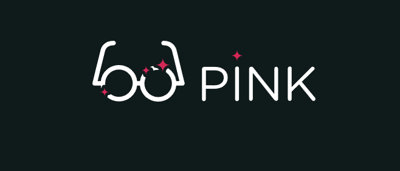

  

## О проекте

##### Pink - мобильное приложение для   раскрашивания серых будней в розовый цвет.

- Адаптивность сетки: мобильная, планшетная и десктопная версии (responsive layout)
- Используемая методология: БЭМ
- Реализация мобильного меню и модальных окон с использованием JS

## 

## Author

- [**Stanislav Kazankov**](https://github.com/kazankovstas/) - _HTML Academy Student_
